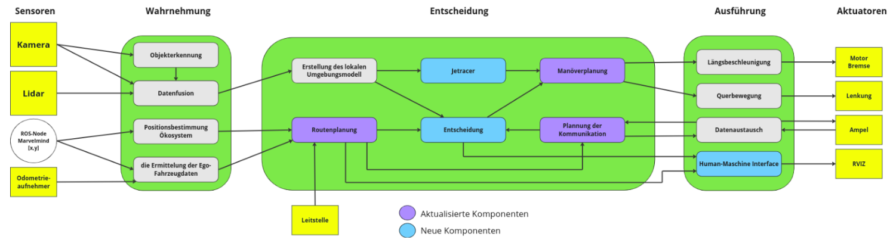
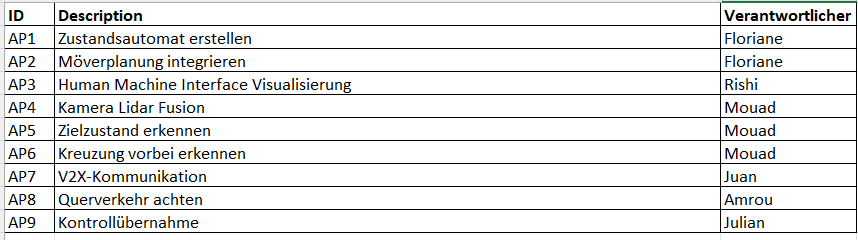
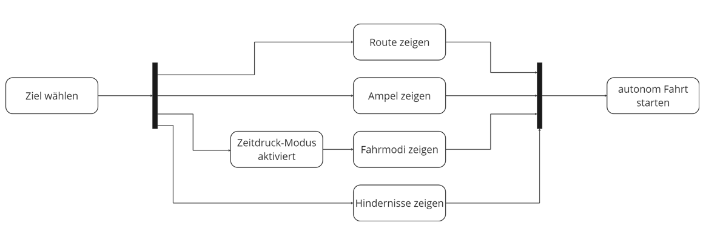
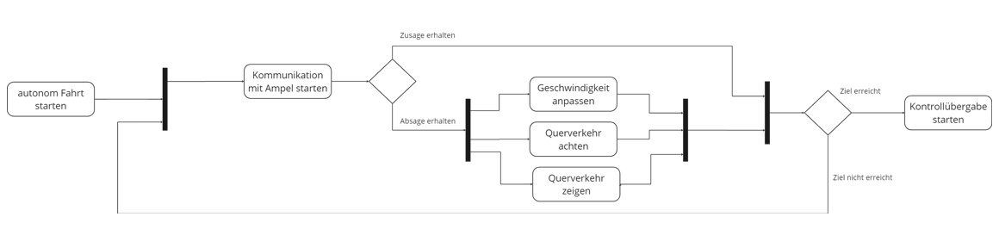
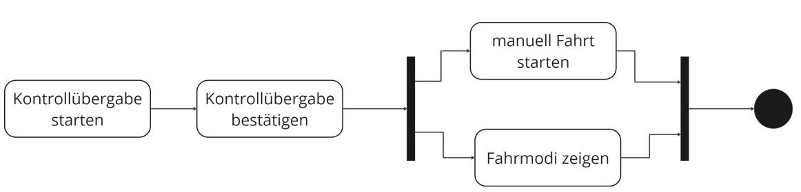
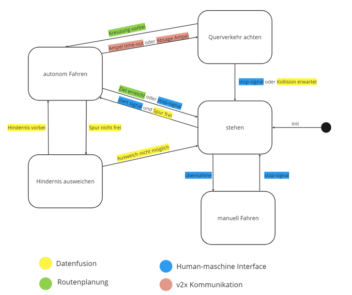

# SMEC Module 6


## Use Case
Das Auto fährt autonom über eine Kreuzung bis zur Unfallstelle und von dort aus weiter zum Krankenhaus, wo es in den manuellen Modus übergibt. 


## Systemarchitektur von SMEC
Im Folgenden wird die für SMEC entwickelte Architektur in einem Sense-Plan-Act-Diagramm beschrieben. Dieses Diagramm hat sich im Laufe der Module verändert. In blauer Farbe sind die neuen Komponenten markiert, die in Modul 6 integriert wurden, und in violetter Farbe die Module, die bereits im System vorhanden waren, aber für Modul 6 modifiziert wurden. Jede der in SMEC implementierten Komponenten hat ihr eigenes Repository, jede von ihnen ist unten zusammen mit dem entsprechenden Link aufgeführt.



- Objekterkennung: https://git.hs-coburg.de/SMEC/objekterkennung
- Datenfusion: https://git.hs-coburg.de/SMEC/camera_lidar_fusion
- Routenplanung: https://git.hs-coburg.de/SMEC/smec_path_planning
- Entscheidung: https://git.hs-coburg.de/SMEC/entscheidung_komponent
- Manöverplanung: https://git.hs-coburg.de/SMEC/manoever_planung
- Planung der Kommunikation: https://git.hs-coburg.de/SMEC/smec_kompv2x
- Human-Machine-Interface: https://git.hs-coburg.de/SMEC/smec_hmi

Eine detaillierte Beschreibung der einzelnen Komponenten finden Sie im jeweiligen Repository, wo Sie Informationen über die Schnittstellen der einzelnen Komponenten sowie den implementierten Code finden können.

## Kriterien von Modul 6
Eine der Hauptaufgaben für dieses Modul war die Integration aller Komponenten, die die SMEC-Architektur darstellen, wofür wir die folgenden Kriterien aufstellten:

1. Das SMEC stellt eine Zieleingabe bereit und fährt autonom in der Modellstadt bis zum Ziel. (Floriane)
2. Das SMEC zeigt dem Benutzer die aktuelle Route, das Ziel, die Ampeln, den Querverkehr und den Fahrmodi an. (Rishi)
3. Das SMEC zeigt dem Benutzer die Ausgabe aus der Kamera Lidar Fusion an. (Mouad)
4. Das SMEC kommuniziert mit den Ampeln und löst eine Grüne Welle aus. (Juan)
5. Das SMEC reagiert auf den Querverkehr in dem es seine Geschwindigkeit anpasst. (Amrou)
6. Das SMEC fordert eine Kontrollübernahme bei Erreichen des Ziels und kann in den manuellen Modus wechseln. (Julian)

## Arbeitspakete
Um die Aufgaben im Team verteilen zu können wurden sog. Arbeitspakete (AP) erstellt.



## Ablaufdiagramm Demo
Um zu erklären, was Sie in der Demo dieses Moduls sehen werden, haben wir ein Diagramm der Aktivitäten erstellt, das unten beschrieben wird:

Zur besseren Veranschaulichung des Diagramms haben wir es in drei Teile unterteilt. Der erste Teil besteht aus der Auswahl des Ziels, zu dem der SMEC fahren soll, bis zum Start des autonomen Fahrens durch den SMEC.
Der zweite Teil beschreibt die Kommunikation mit einer Ampel an der Kreuzung und der letzte Teil beschreibt die Übergabe der Kontrolle an einen Rettungssanitäter.

Die Demo beginnt mit der Auswahl des Ziels von SMEC, diese Koordinaten werden normalerweise von der Leitstelle geliefert, aber in unserem Fall schreiben wir sie direkt in das Terminal als Argumente. Sobald SMEC diese Informationen erhält, wird die Visualisierung in Rviz angezeigt. In Rviz sehen Sie Informationen über die Route, der der SMEC folgen muss, die Ampeln auf der Route, die Fahrmodi, auf denen sich der SMEC befindet und die möglichen Hindernisse, die auf dem Weg erkannt werden können. Der Fahrmodi Zeitdruck-Modus wurde als Standard gewählt, da unser Use Case eine Situation darstellt, in der der SMEC auf einen Notfall zusteuert. Nach der Visualisierung startet der SMEC seine autonome Route.


Nachdem der SMEC seine autonome Fahrt begonnen hat, muss er auf einer Kreuzung mit einer roten Ampel treffen. Die erste Ampel in der Modellstadt sendet nach dem Empfang einer SRM (Signal Request Message) eine Absage in einer SSM (Signal Status Message) Nachricht. Für diese Demo haben wir die Ampeln so konfiguriert, dass sie immer ein rotes Licht zeigen und die erste Ampel immer eine Absage auf die Ampelwechselanforderung sendet. Nach Erhalt der Absage durch die Ampel reduziert der SMEC seine Geschwindigkeit und überquert die Kreuzung bei Rot, wobei er immer berücksichtigt, ob es andere Fahrzeuge gibt, mit denen er kollidieren könnte.

Wenn die Ampel den Ampelwechsel bestätigt (nur für die zweite Ampel in der Modellstadt), setzt der SMEC seine normale Route fort, ohne die Geschwindigkeit zu verringern.


Der SMEC prüft immer, ob das zuvor eingestellte Ziel erreicht ist. Sobald der SMEC sein Ziel erreicht hat, beginnt die Übergabe der Kontrolle an den Rettungssanitäter. Die Kontrollübergabe erfolgt am Terminal, wo es angezeigt wird, dass der SMEC das Ziel erreicht hat und die Kontrollübergabe bestätigt wird. Sobald die Übergabe der Kontrolle durch den Rettungssanitäter bestätigt ist, ändert sich das SMEC-Fahrmodi und wird in Rviz angezeigt. Damit ist die SMEC-Demonstration abgeschlossen.


## Konzept von SMEC
Das folgende Zustandsdiagramm zeigt das Konzept, das für SMEC entwickelt wurde. Dieses Konzept hat fünf Zustände, die sind:


Stehen: In diesem Zustand ist der SMEC angehalten.
Autonom Fahren: In diesem Zustand fährt der SMEC autonom.
Querverkehr achten: In diesem Zustand fährt der SMEC autonom, aber mit Vorsicht.
Manuell Fahren: In diesem Zustand fährt der SMEC nicht mehr autonom und benötigt einen Fahrer, der die Kontrolle über das Fahrzeug übernimmt.
Hindernis ausweichen: In diesem Zustand muss SMEC ein Hindernis ausweichen durchführen.

Die Linien, die die einzelnen Zustände verbinden, sind die Signale, die für einen Zustandswechsel erforderlich sind. 
Unser Konzept beginnt mit einem gestoppten SMEC (Zustand Stehen), dann muss der Fahrer ein Startsignal eingeben, das der Schnittstelle /start entspricht und von der Komponente Human-Maschine-Interface des SMEC geliefert wird, aber gleichzeitig ist für einen Zustandswechsel (zum Zustand Autonomes Fahren) ein Signal erforderlich, das bestätigt, dass die Fahrspur, auf der er sich befindet, frei ist. Dieses Signal wird von der Komponente Datenfusion geliefert und hat den Namen /lane_free. Es ist zu beachten, dass alle diese Schnittstellen ROS2-Topic sind und den Typ Bool haben.
Stellen wir uns vor, der SMEC befindet sich im Zustand Autonom Fahren und steht vor einer Situation, in der er eine Kreuzung mit Ampeln überqueren muss. Der SMEC kann eine grüne Welle ausführen, um sein Ziel schneller zu erreichen, falls der SMEC eine Absage von der Ampel erhält und den Ampelwechsel nicht ausführen kann oder falls die Ampel keine Antwort sendet, wechselt der SMEC seinen Zustand auf Querverkehr achten. Das bedeutet, dass der SMEC seine Fahrt fortsetzen kann, ohne anhalten zu müssen, aber er muss dafür langsamer werden. Die Informationen über das Absage einer Ampel und das time-out  werden von der Komponente Planung der Kommunikation bereitgestellt und haben die Namen /tf_cancellation bzw. /tf_timeout.

Nachdem der SMEC die Kreuzung überqueren kann, ist es notwendig, dass die Komponente Routenplanung ein Signal sendet, das bestätigt, dass die Kreuzung überquert wurde. Dieses Topic hat den Namen /intersection_over. Mit dieser Information kann der SMEC in den Zustand des autonomen Fahrens zurückkehren und seine autonome Route fortsetzen.

Stellen wir uns nun eine Situation vor, in der der SMEC ein Ausweichmanöver durchführen muss, weil ein Hindernis im Weg steht. Damit SMEC das Ausweichmanöver durchführen kann, muss die Komponente Datenfusion Informationen über den Status der Fahrspur senden. Wenn ein Hindernis erkannt wird, empfängt SMEC ein Signal namens /evade und ändert somit den Status von autonomem Fahren auf Hindernis ausweichen. Damit SMEC wieder in den Zustand des autonomen Fahrens zurückkehrt, muss die Datenfusion-Komponente ein Signal namens /obstacle_passed senden, das gesendet wird, wenn das Hindernis bereits ausgewichen wurde. Falls das Ausweichmanöver nicht durchgeführt werden kann, z.B. weil das Hindernis zu groß ist, muss die Datenfusion-Komponente ein Signal mit dem Namen /evade_impossible senden und der SMEC wechselt in den Zustand Stehen, um einen Unfall zu vermeiden.

Die letzte Situation ist, wenn der SMEC sein Ziel erreicht. Zu diesem Zeitpunkt muss die Komponente Routenplanung ein Signal namens /goal senden und der SMEC wechselt vom autonomen Zustand Fahren in den Zustand Stehen. Sobald sich der SMEC in diesem Zustand befindet, wird die Kontrolle durch ein Signal namens /takeover an den Bediener übergeben, dieses Topic wird von der Komponente Human Machine Interface geliefert. Zu diesem Zeitpunkt befindet sich der SMEC im Zustand des manuellen Fahrens und der Fahrer  hat die Kontrolle über den SMEC.

## Requierements
Im Folgenden werden die Voraussetzungen beschrieben, die für die Ausführung der oben beschriebenen Demo erforderlich sind:

- Das Marvel-Mind  läuft einwandfrei (siehe https://git.hs-coburg.de/Autonomous_Driving/ros_marvelmind_package.git)
- Clonen Sie die folgenden Repos in ihren Ros2_workspace/src:
- Komponente Entscheidung:
```
git clone https://git.hs-coburg.de/SMEC/entscheidung_komponent.git
```
- Komponente Mannöverplanung:
```
git clone https://git.hs-coburg.de/SMEC/manoever_planung_modul6.git
```
- Komponente Routenplanung
```
git clone https://git.hs-coburg.de/SMEC/smec_path_planning.git
```
- Komponente Human-Machine-Interface
```
git clone https://git.hs-coburg.de/SMEC/smec_hmi.git
```
- Komponente Planung der Kommunikation
```
git clone https://git.hs-coburg.de/SMEC/smec_kompv2x.git
```
Alle diese Pakete müssen in Ihrem ros-workspace erstellt werden. Führen Sie dazu die folgenden Befehle aus:
```
cd ..
```
```
colcon build --symlink-install
```
```
source install/setup.bash
```

## How to start 
Im Folgenden sind die Befehle aufgeführt, die für die Ausführung der einzelnen Komponenten eingegeben werden müssen:

```
ros2 run entscheidungs_component decision
```
```
ros2 run smec_path_planning pathpl --ros-args -p ziel_x:=8.0 -p ziel_y:=3.0
```
```
ros2 launch launch_komp_v2x.py
```
```
ros2 run manoever_planung_modul6 motion
```
```
ros2 run smec_hmi command
```
```
ros2 run smec_hmi hmi
```
```
ros2 run smec_hmi ampel
```
```
ros2 run smec_hmi v2v
```
```
rviz2
```
- Die folgenden Topics sind für die Visualisierung in Rviz erforderlich: 
route, goalpoint, textmarker, ampel, v2v


